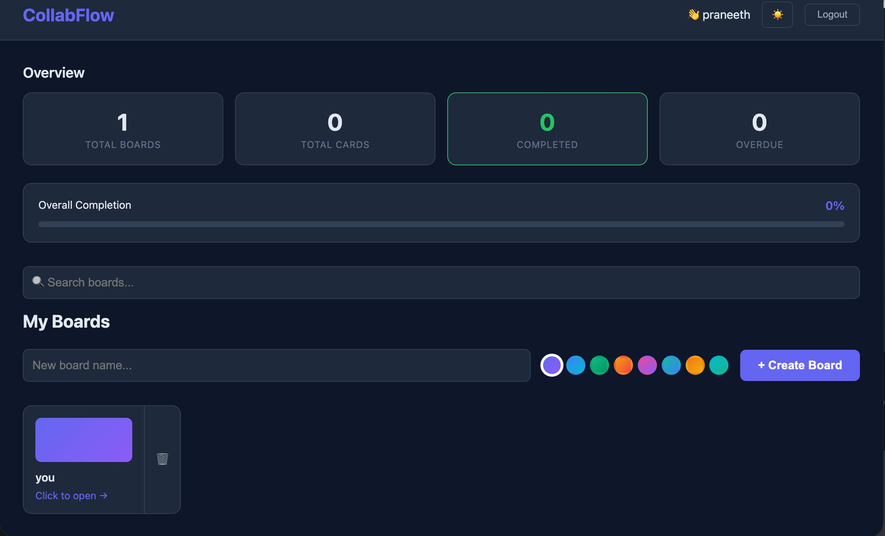

<div align="center">



<br/><br/>

# 🚀 CollabFlow

### Real-time Collaborative Task Management Platform

[](https://collabflow-seven.vercel.app)
[](https://collabflow-api.onrender.com)
[](https://github.com/praneethcheturi-143/collabflow)


</div>

---

## 🎯 What is this?

CollabFlow lets multiple users collaborate on Kanban boards in **real-time**. Every card move, comment, and status change is instantly broadcast to all connected users via Socket.io — no refresh needed.

> Demonstrates the full engineering challenge behind tools like Trello — WebSockets, auth, database design, and deployment all working together in production.

---

## ✨ Features

| Category | Features |
|----------|----------|
| 🔐 **Auth** | JWT authentication · bcrypt hashing · role-based access |
| 📋 **Boards** | Create/delete · 8 gradient themes · search |
| 🃏 **Cards** | Title · description · color labels · due dates · drag and drop |
| 👥 **Collaboration** | Comments · checklists with progress bars · online presence |
| ⚡ **Real-time** | All changes broadcast instantly via Socket.io |
| 📊 **Analytics** | Total boards · cards · completion rate · overdue count |
| 🎨 **UX** | Dark/light mode · loading skeletons · toast notifications |
| 🔒 **Security** | Rate limiting · helmet.js · Joi validation · CORS |
| 🐳 **DevOps** | Docker · GitHub Actions CI/CD · health check endpoint |

---

## ⚡ Real-time Architecture

```
User drags card
      ↓
REST PUT /api/cards/:id  →  Database updated
                          ↓
              Socket.io broadcasts to all
              connected board members
                          ↓
              All clients update instantly
              (no page refresh needed)
```

---

## 🏗️ Full Architecture

```
┌─────────────────────────────────────────────────────┐
│            React 18 Frontend (Vercel)                │
│   React Router · Socket.io Client · DnD · Axios    │
└────────────┬──────────────────────────┬─────────────┘
             │ REST                     │ WebSocket
┌────────────▼──────────────────────────▼─────────────┐
│         Node.js + Express Backend (Render)            │
│   JWT Auth · Socket.io · Joi · helmet · rate-limit   │
└────────────┬──────────────────────────────────────────┘
             │ Sequelize ORM
┌────────────▼──────────────────────────────────────────┐
│            PostgreSQL — Neon Cloud                     │
│   Users · Boards · Cards · Comments · Checklists     │
└───────────────────────────────────────────────────────┘
```

---

## 📡 API Endpoints

| Method | Endpoint | Description |
|--------|----------|-------------|
| `POST` | `/api/auth/register` | Register new user |
| `POST` | `/api/auth/login` | Login + return JWT |
| `GET` | `/api/boards` | All boards for user |
| `POST` | `/api/boards` | Create board |
| `GET` | `/api/boards/:id` | Board + all cards |
| `DELETE` | `/api/boards/:id` | Delete board |
| `POST` | `/api/cards` | Create card |
| `PUT` | `/api/cards/:id` | Update card |
| `DELETE` | `/api/cards/:id` | Delete card |
| `GET/POST` | `/api/cards/:id/comments` | Card comments |
| `GET/POST/PUT/DELETE` | `/api/cards/:id/checklist` | Checklist CRUD |
| `GET` | `/api/health` | Server + DB status |

---

## 🗄️ Database Schema

```
Users        → id · email · password_hash · name
Boards       → id · title · color · owner_id → Users
Cards        → id · title · description · status · label · due_date · board_id → Boards
Comments     → id · text · user_id → Users · card_id → Cards
Checklists   → id · text · completed · card_id → Cards
```

---

## 🛠️ Tech Stack

**Frontend:** React 18 · React Router v6 · Socket.io Client · @hello-pangea/dnd · Axios · react-hot-toast

**Backend:** Node.js · Express.js · Socket.io · Sequelize ORM · PostgreSQL (Neon) · JWT · bcryptjs · Joi · helmet · express-rate-limit

**DevOps:** Docker · docker-compose · GitHub Actions CI/CD · Render · Vercel

---

## ⚡ Run Locally

```bash
git clone https://github.com/praneethcheturi-143/collabflow
cd collabflow

# Backend
cd server && npm install
cp ../.env.example .env
npm run dev               # → :3001

# Frontend
cd client && npm install
npm start                 # → :3000

# Docker
docker-compose up --build
```

---

## ✅ Skills Demonstrated

`React 18` · `Node.js/Express` · `Socket.io WebSockets` · `JWT auth` · `bcrypt` · `PostgreSQL` · `Sequelize ORM` · `Drag and drop` · `REST API design` · `Joi validation` · `helmet.js` · `Rate limiting` · `Docker` · `GitHub Actions CI/CD` · `Render` · `Vercel`

---

<div align="center">

**Built by [Praneeth Cheturi](https://github.com/praneethcheturi-143)**

[](https://collabflow-seven.vercel.app)

</div>
